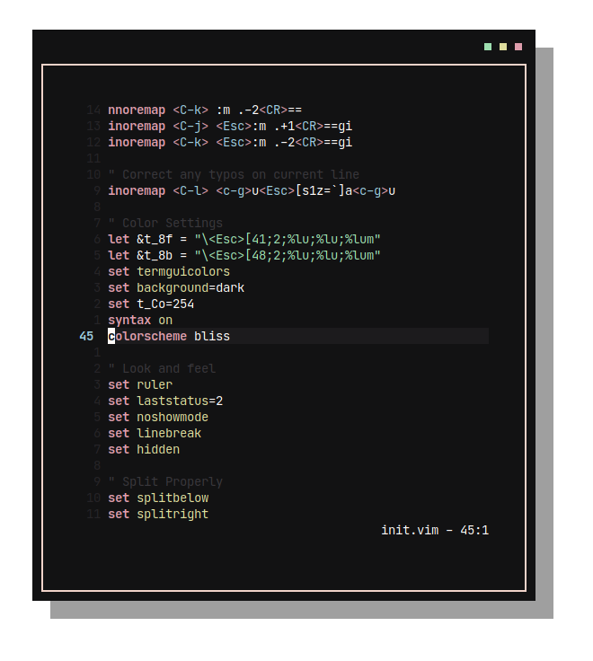

<h1 align="center">Bliss.</h1>

## Installation

Move `/vim/bliss.vim` into your Vim colors folder, usually `~/.vim/colors` or `~/.config/nvim/colors`. Then set `colorscheme bliss` in your Vim config.
